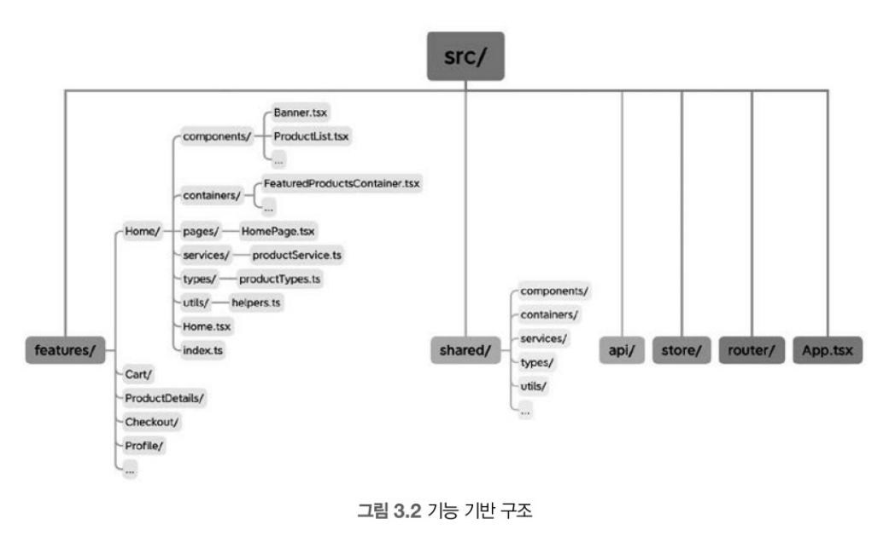
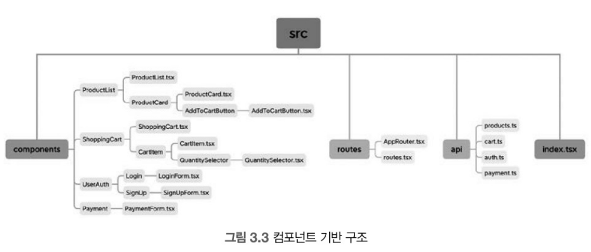
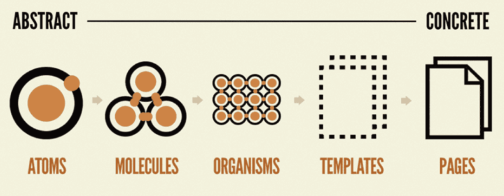
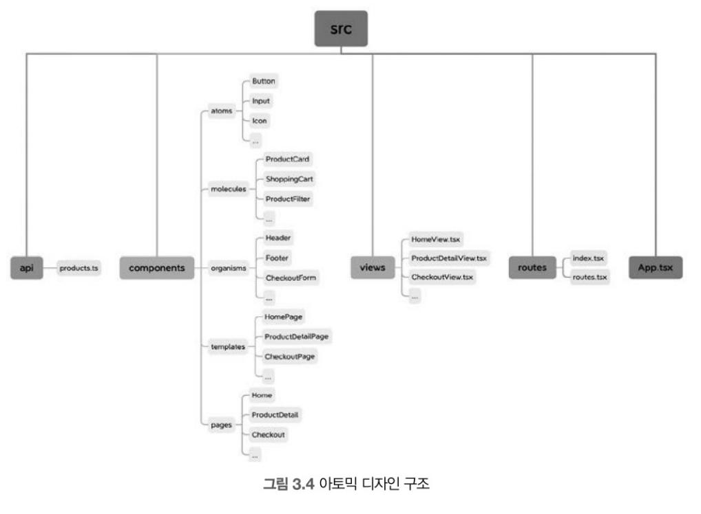
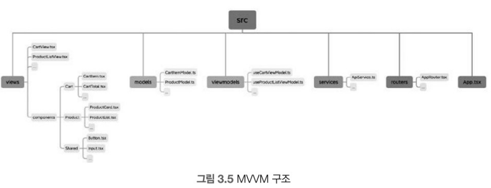

# ch3. 리액트 애플리케이션 구조

해당 챕터에서는 리액트 애플리케이션의 일반적인 체계 및 구조에 관한 다양한 전략을 다룸

## 목차

- [3.1 구조화되지 않은 프로젝트의 문제점](3.1-구조화되지-않은-프로젝트의-문제점)
- [3.2 프런트엔드 애플리케이션의 복작함에 대한 이해](3.2-프런트엔드-애플리케이션의-복잡함에-대한-이해)
- [3.3 일반적인 리액트 애플리케이션 구조](3.3-일반적인-리액트-애플리케이션-구조)
- [3.4 프로젝트 구조를 체계적으로 유지하기](3.4-프로젝트-구조를-체계적으로-유지하기)

## 3.1 구조화되지 않은 프로젝트의 문제점

- 소규모 프로젝트에서는 구조화를 굳이 안해도 되지만 규모가 커질 수록 구조화를 통해 파일 관리가 필요함 
- 대규모 프로젝트에서 구조화를 하지 않을 경우 코드를 효과적으로 관리 및 유지보수 하기 어려움

### 문제점

- **무질서한 코드**: 명확한 구조가 없을 경우 파일 및 컴포넌트를 찾기 어려움
- **낮은 코드 재사용성**: 적절한 구조가 없으면 컴포넌트 및 기능을 식별하는것이 쉽지 않음 -> 코드 중복, 일관성 부족에 따른 코드베이스를 유지하고 업데이트 하기 어려워짐
- **협업의 어려움**: 팀원 간 합의된 구조가 없을 경우 각자의 코드를 이해 및 탐색하기 어려우며 버그, 충돌 가능성이 높아짐
- **확장성 문제**: 프로젝트 규모가 커지거나 기능이 늘어날수록 기존코드에 통합 어려워지며 확장 및 수정이 어려운 코드가 되기 쉬움
- **유지보수 문제**: 명확한 구조가 없어 유지보수 하기 어렵고 코드 컨벤션이 없어 기능 변경 및 문제 해결에 많은 시간이 소요될 수 있음

## 3.2 프런트엔드 애플리케이션의 복잡함에 대한 이해

### 리엑트의 일반적인 폴더 및 파일 구조

- **소스 코드**: 애플리케이션의 로직을 담고 있는 자바스크립트 또는 타입스크립트 및 UI, 애플리케이션 동작과 사용자 인터페이스를 포함
  - Modal, 메뉴 탐색 및 버튼, 카드 등 공용으로 사용하는 컴포넌트
  - 특정 기능을 위한 컴포넌트
  - 커스텀 훅
- **에셋(assets)**: 애플리케이션에서 사용하는 이미지, 폰트, 비디오 등 시각적 경험 및 상호작용을 위한 파일들을 포함

- **설정**: 의존성 목록을 관리하는 `package.json` 및 환경 변수 등 애플리케이션 배포 및 운영에 필요한 파일들을 포함

  - global.css, package.json 등
  - Eslint 설정, webpack 설정 등

- **테스트**: 사용자 동작을 재현 및 상호작용을 검증하여 애플리케이션의 기능을 확인하는 파일들을 포함
  - 단위 테스트와 브라우저 테스트
- **문서**: 프로젝트 개요를 제공하는 README, API 문서등을 포함
- **빌드 결과물**: 애플리케이션을 최종 사용자에게 전달하는 핵심 요소

프로젝트를 위한 다양한 파일들을 정리하는 방법은 따로 정해지지 않았지만 코드베이스를 **일관되게 정리**하는것이 가장 좋음 
어떤 방식을 선택하든 프롲ㄱ테 즌번에 걸쳐 일관된 방식을 유지해아 함

## 3.3 일반적인 리액트 애플리케이션 구조

리엑트 애플리케이션을 만드는 구조 중 자주 사용되는 4가지 구조는 아래와 같음

- [기능 기반 구조](3.3.1-기능-기반-구조)
- [컴포넌트 기반 구조](3.3.2-컴포넌트-기반-구조)
- [아토믹 디자인 구조](3.3.3-아토믹-디자인-구조)
- [MVVM 구조](3.3.4-MVVM-구조)

_**아래 각 구조에 대한 이미지 및 설명은 `온라인 쇼핑몰`을 예시로 설명함**_

### 3.3.1 기능 기반 구조

- 애플리케이션을 **기능**과 **모듈** 중심으로 구조화 하는것을 의미 
- 기능 단위로 명확하게 분리하기 위해 컴포넌트와 뷰, API 호출, 상태관리를 캡슐화 하여 관리

  

#### 구조 분석

- `/feature`: `Home`, `Cart`, `ProductDetails`, `Checkout`, `Profile`등과 같은 애플리케이션의 **기능**을 담당
  - 각 기능마다 필요한 components, type 등은 해당 폴더의 하위로 생성
- `/shared`: 여러 기능에서 공유하여 재사용되는 components, type, utils 등을 포함
- `/api`: API 호출과 관련된 소스코드
- `/store`: 상태 관리를 위한 모듈
- `/router`: 라우팅 설정 관련 컴포넌트
- `App.tsx`: 애플리케이션 시작점

#### 장점

- **명확한 관심사 분리**: 각 기능과 관련된 코드를 쉽게 찾고 수정 가능
- **모듈화**: 기능 단위로 코드를 분리하여 코드 테스트 및 재사용에 용이함
- **확장성**: 새로운 기능이 추가될 때 기존 코드에 영향을 주지 않음
- **팀 협업**: 여러 기능을 개발자들이 동시에 작업하더라도 충돌을 최소화 할 수 있음

#### 단점

- **코드 중복**: 비슷한 기능을 가지고 있는 컴포넌트 또는 로직을 가지고 있는 코드의 경우 중복이 발생될 수 있음

---

### 3.3.2 컴포넌트 기반 구조

- 애플리케이션을 **재사용** 할 수 있는 **컴포넌트** 단위로 구조화

  

#### 구조 분석

- `/components`: 애플리케이션의 여러 기능에서 사용하는 개별 컴포넌트들을 가지며 각각의 컴포넌트 폴더에 존재함. 필요에 따라 자식 컴포넌트를 가짐
- `/routes`: 애플리케이션의 라우팅을 담당하며 라우팅 로직을 설정하는 메인 `AppRouter.tsx` 파일, 개별 라우팅 경로 및 해당하는 컴포넌트들을 담은 `router.tsx`가 이곳에 위치함
- `/api`: API 호출 및 응답을 담당하며 `products.ts`, `cart.ts`, `auth.ts`, `payment.ts`을 통해 호출/응답 타입을 지정할 수 있음

#### 장점

- **모듈화**: 기능 단위의 컴포넌트를 별도의 파일 및 폴더에 구분 및 모듈화 하여 코드 유지보수가 쉽고 재사용성이 높아짐
- **관심사 분리**: 각 컴포넌트의 기능에 집중할 수 있어 코드가 간결해지며 디버깅이 쉬움.
- **재사용성**: 하나의 애플리케이션 뿐만 아니라 다른 프로젝트에서도 활용할 수 있음

#### 단점

- **프로젝트 복잡도 증가**: 프로젝트가 커질수록 컴포넌트 폴더 구조가 복잡해지고 단순하게 유지하기 어려움
- **높은 진입장벽**: 컴포넌트 기반의 개발 및 타입스크립트가 익숙치 않을 경우 높은 진입장벽으로 인해 쉽게 적용하기 어려움
- **코드 중복**: 비슷한 기능이나 로직의 컴포넌트들과 중복일 가능성이 높음

---

### 3.3.3 아토믹 디자인 구조

**아토믹 디자인이란?** 아주 작은 단위(원자)부터 원자를 포함한 조금 더 큰 단위(분자), 이를 포함한 단위(유기체), 템플릿, 페이지 등의 단위로 구분

#### 어떻게 분류하는가?

> 출처: https://blog.naver.com/designer-jw/222867527430

- **원자**: UI를 구성하는 가장 작은 단위, 버튼, 인풋 등의 기본 요소들이 해당됨
- **분자**: 원자들을 조합한 여러 원자가 상호작용을 하는 기능 단위를 구성, 폼 입력, 네비게이션 바 등이 해당됨
- **유기체**: 분자 및 원자들을 결합하여 기능 영역의 UI를 표현하며 헤더, 사이드바, 카드 컴포넌트 등 **사용자 인터페이스의 기능 영역**을 담당함
- **템플릿**: 분자 또는 유기체들을 배치하는 레이아웃 구조, 페이지 전반의 구조 및 UI의 기능을 담당함
- **페이지**: 원자, 분자, 유기체, 템플릿을 모두 결함한 온전한 사용자 화면, **사용자가 볼 수 있는 화면을 제공하는 최종 결과물**

#### 아토믹 디자인 핵심

- UI 컴포넌트를 만드는 체계적인 접근 방식 설계
- 재사용성과 확장성, 유지보수 용이
- 컴포넌트를 구성하고 이름을 지정하기 위한 명확한 구조를 제시
- 이를 통한 UI 코드베이스를 쉽게 위해 및 탐색

#### 온라인 쇼핑몰을 아토믹 디자인으로 설계 시 구조

#### 구조 분석

- `/atoms`, `molecules`, `organisms`, `/templates`, `/pages`: 컴포넌트 합성 및 추상화의 다양한 레벨을 나타냄
- `/api`: API 호출 관련 파일들을 담고 있음
- `/views`: 컴포넌트를 랜더링 하는 개별 단위 뷰 파일을 담고 있음
- `/routes`: 라우팅 설정 파일을 담고 있음

#### 장점

- **재사용성**: 애플리케이션 전체에서 커포넌트를 쉽게 재사용 할 수 있음
- **일관성**: 디자인 패턴, 스타일을 UI에 일관되게 적용할 수 있음
- **확장성**: 컴포넌트를 모듈화하여 접근하기 때문에 기능 확장 및 신규 컴포넌트 추가에 용이함
- **유지보수**: 컴포넌트가 논리적으로 분리되어 있어 유지보수 쉬움
- **협업**: 아토믹 디자인 구조 특성 상 디자이너<->개발자 간 UI 컴포넌트에 관해 공통 언어 역할을 하므로 협업하기 쉬움

#### 단점

- **높은 진입장벽**: 익숙하지 않은 방법론이기 때문에 별도 학습이 필요함
- **복잡도**: 애플리케이션의 규모가 커질수록 컴포넌트 개수가 늘어나고 관계가 복잡하여 관리가 어려움
- **오버 엔지니어링**: 과도한 추상화는 구조를 복잡하게 만드는 원인이 될수도 있으므로 항상 컴포넌트 재사용성, 오버 엔지니어링 사이의 균형을 맞춰야함

---

### 3.3.4 MVVM 구조

MVVM(Model-View-ViewModel): 주로 사용자 인터페이스를 만드는데 사용되는 **아키텍쳐 패턴**

- **모델**: 애플리케이션의 데이터와 로직을 담당하며 **DB, API 호출 등을 통해 데이터를 가져오고 처리함**
- **뷰**: 사용자가 보는 화면과 사용자 인터페이스 요소를 나타내며 **상호작용을 통해 사용자 입력을 받고 뷰 모델을 통해 데이터를 표시함**
- **뷰모델**: 뷰의 요청에 따라 모델에서 데이터를 가져와 가공하고 뷰에 표시될 수 있도록 데이터 바인딩을 함

  

---
